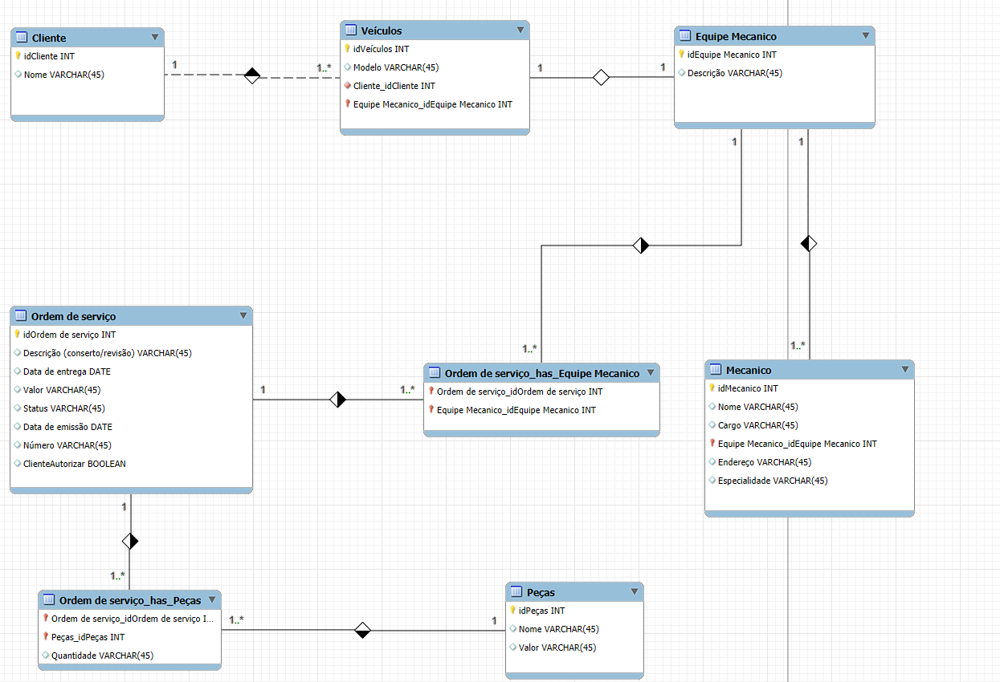

# Sistema de Controle de Ordens de Serviço para Oficina Mecânica

Este projeto consiste na modelagem de um banco de dados para gerenciar ordens de serviço em uma oficina mecânica. O sistema foi implementado para organizar clientes, veículos, equipes de mecânicos, peças, e o fluxo operacional de conserto e revisão de veículos. O objetivo é fornecer uma solução robusta e eficiente para acompanhar as atividades da oficina.

## 🔧 Estrutura do Banco de Dados

A modelagem do banco de dados é composta pelas seguintes entidades principais:

### 1. **Cliente**
Armazena informações sobre os clientes que levam veículos à oficina.
- **Atributos:**
  - `idCliente`: Identificador único do cliente.
  - `Nome`: Nome do cliente.

### 2. **Veículos**
Representa os veículos cadastrados na oficina.
- **Atributos:**
  - `idVeículos`: Identificador único do veículo.
  - `Modelo`: Modelo do veículo.
  - `Cliente_idCliente`: Relaciona o veículo ao cliente proprietário.
  - `Equipe_Mecanico_idEquipe_Mecanico`: Relaciona o veículo à equipe responsável.

### 3. **Equipe Mecânico**
Agrupa equipes fixas responsáveis por avaliar e executar os serviços em veículos.
- **Atributos:**
  - `idEquipe_Mecanico`: Identificador único da equipe.
  - `Descrição`: Descrição ou nome da equipe.

### 4. **Mecânico**
Armazena informações sobre os profissionais que compõem as equipes da oficina.
- **Atributos:**
  - `idMecânico`: Identificador único do mecânico.
  - `Nome`: Nome do mecânico.
  - `Cargo`: Cargo ou função do mecânico.
  - `Endereço`: Endereço do mecânico.
  - `Especialidade`: Área de especialidade do mecânico.
  - `Equipe_Mecanico_idEquipe_Mecanico`: Relaciona o mecânico à equipe.

### 5. **Ordem de Serviço (OS)**
Centraliza as informações sobre os serviços executados.
- **Atributos:**
  - `idOrdem_de_Serviço`: Identificador único da ordem de serviço.
  - `Descrição`: Detalhes do serviço (conserto/revisão).
  - `Data de Entrega`: Prazo de entrega do serviço.
  - `Valor`: Valor total do serviço.
  - `Status`: Estado atual da OS (ex.: "Aguardando aprovação", "Em execução").
  - `Data de Emissão`: Data de emissão da OS.
  - `Número`: Número único da OS.
  - `ClienteAutorizar`: Indica se o cliente autorizou a execução.

### 6. **Peças**
Armazena informações sobre as peças utilizadas nos serviços.
- **Atributos:**
  - `idPeças`: Identificador único da peça.
  - `Nome`: Nome da peça.
  - `Valor`: Valor da peça.

### 7. **Relacionamentos Auxiliares**

- **Ordem_de_serviço_has_Equipe_Mecânico**:
  - Relaciona ordens de serviço às equipes de mecânicos.
  - **Atributos:**
    - `Ordem_de_serviço_idOrdem_de_Serviço`
    - `Equipe_Mecanico_idEquipe_Mecanico`

- **Ordem_de_serviço_has_Peças**:
  - Relaciona ordens de serviço às peças utilizadas, incluindo quantidade.
  - **Atributos:**
    - `Ordem_de_serviço_idOrdem_de_Serviço`
    - `Peças_idPeças`
    - `Quantidade`

---

## 🛠️ Funcionalidades do Sistema

1. **Gerenciamento de Clientes:** Controle completo de clientes e seus veículos.
2. **Gestão de Ordens de Serviço:** Controle centralizado para monitorar o andamento e detalhes de cada serviço.
3. **Controle de Equipes:** Associa equipes de mecânicos a veículos e serviços de forma organizada.
4. **Controle de Peças:** Rastreamento das peças utilizadas em cada serviço.
5. **Automação de Cálculos:** Soma automática do valor das peças e mão de obra para compor o valor final da OS.

---

## 📚 Pré-requisitos

1. **Sistema Gerenciador de Banco de Dados (SGBD):** MySQL, MariaDB ou outro compatível com SQL.
2. **Ferramenta de Modelagem:** Diagrama criado com ferramentas como MySQL Workbench.

---

## 🚀 Configuração do Banco de Dados

1. Execute o script SQL correspondente à modelagem do banco de dados.
2. Configure as chaves estrangeiras para manter a integridade referencial entre as tabelas.
3. Popule as tabelas com dados iniciais para validar a implementação.

---

## 🖼️ Diagrama do Banco de Dados

---

## 📬 Contato

Caso tenha dúvidas ou sugestões sobre este projeto, entre em contato:

- **Email:** [andreicardozo300@gmail.com]
- **GitHub:** [https://github.com/AndreiCardozo]

